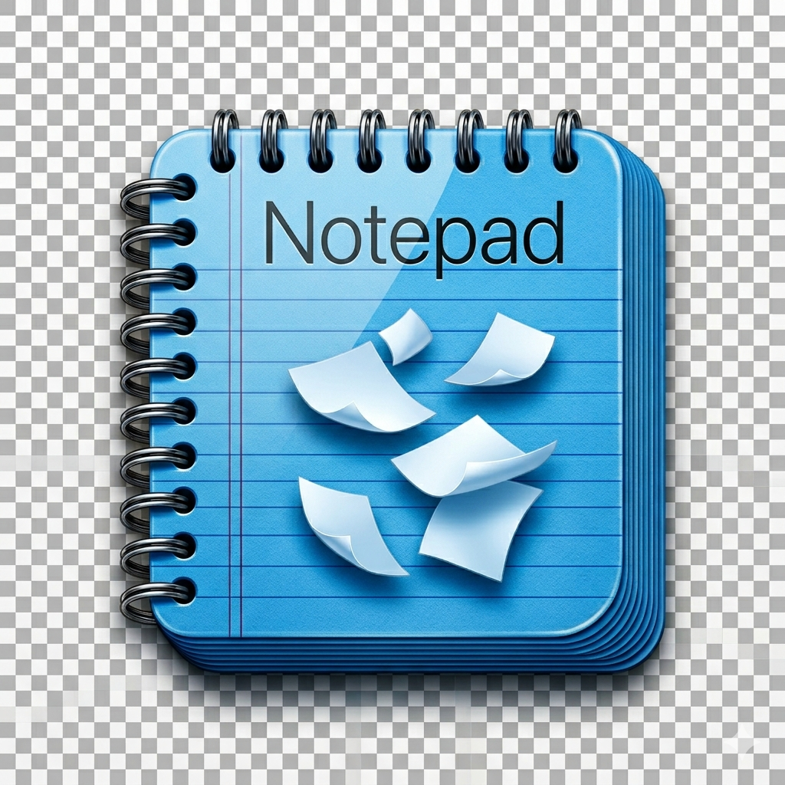

# Minimal Notepad



### 🚀 Stop Fighting Your Editor. Start Writing.
Minimal Notepad is the ultimate antidote to modern software bloat. While other editors crush your machine under the weight of electron processes, heavy plugins, web views, and constant telemetry updates, Minimal Notepad launches instantly into a pristine, native macOS layout. No configuration files, no cloud syncing interruptions, and no notifications—just a blazing-fast, laser-focused text buffer designed to get out of your way so you can do your best work.

---


Minimal Notepad is a lightweight native macOS plain text editor designed for fast, frictionless editing workflows. It launches instantly into an empty buffer, allows users to open and inspect arbitrary file types from disk, and provides explicit manual saving via direct filesystem overwrite. The application is built intentionally to eliminate configuration overhead, plugins, and cloud abstractions, serving as a reliable fallback editor that stays out of your way.

---

## Features

- **Instant-Launch Scaffolding:** Single-window application context implemented entirely with AppKit and an optimized TextKit 1 layout manager engine.
- **Universal File Access:** Opens arbitrary files from disk with fallback byte-decoding heuristics (`UTF-8`, `macOSRoman`, `Windows-CP1252`, `UTF-16`) to guarantee viewport rendering without freezing.
- **In-Memory Sequential Search & Replace:** Integrated inline overlay view allowing incremental character matching, single occurrence replacement, and global substitution passes via linear string evaluations.
- **Strict Plain-Text Handling:** Enforces uniform system monospaced layout typing attributes across all insertion points, scrubbing incoming system rich-text styling or graphic payloads.
- **Native Filesystem Controls:** Direct, unsandboxed filesystem integration supporting native Save/Open panels, file path drag-and-drop operations, symlink resolution, and unsaved dirty-state window tracking with alert sheets.

---

## Tech Stack

- **Frontend / UI:** AppKit, `NSTextView`, `NSLayoutManager`, `NSTextStorage`, `NSTextContainer` (TextKit 1)
- **Core Language:** Swift
- **Build Tooling:** GNU Make, Shell Scripting, `swiftc` compiler

---

## Project Structure

```text
├── main.swift                 Single main source code entry point containing application delegates, view controllers, and view layouts
├── Makefile                   Unified automation script handling asset assembly, compilation flags, bundle building, and app registration
├── HLD.md                     High-Level Design document mapping functional boundaries, edge cases, and architectural invariants
├── PRD.md                     Product Requirements Document defining core metrics, user targets, and system exclusions
└── tasks.md                   Technical roadmap establishing task ordering, dependencies, and implementation sequencing

```

---

## Installation

The application requires macOS 11.0 or newer and the Xcode Command Line Tools.

1. Clone the repository to your local computer.
2. Ensure any custom app icon file named `AppIcon.icns` is placed directly in the root project directory if icon branding is desired.
3. Open your terminal in the root directory and build the standalone bundle:

```bash
   make

```

---

## Usage

### Running the Application

Launch the compiled bundle directly using the `make` configuration runner:

```bash
make run

```

Alternatively, execute or open the generated application target located within the build folder:

```bash
open build/"Minimal Notepad.app"

```

### Keyboard Shortcuts

* `Cmd + N` — Initialize a new file buffer context (triggers safety sheets if active buffer is dirty)
* `Cmd + O` — Open system file navigation panel
* `Cmd + S` — Commit internal text storage back to disk via atomic write
* `Cmd + Shift + S` — Trigger Save As dialog box to duplicate or reposition storage tracking
* `Cmd + F` — Display inline search and substitution tracking tray interface
* `Cmd + Q` — Terminate the host application safely

---

## Configuration

The application operates zero-configuration and runs entirely standalone without ambient environment variables, external configuration manifests, initialization files, or network tracking requirements.

